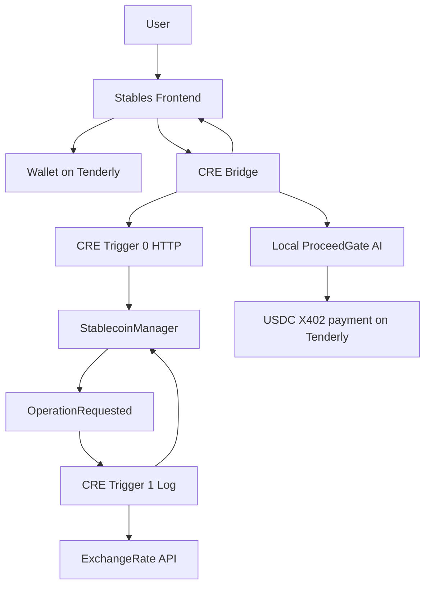

# Stables = Stablecoins + ProceedGate AI Agent

Stables is a **single dApp solution** that combines Stablecoins and a gating AI:

- a React frontend for stablecoin mint/burn requests
- a **Chainlink CRE** workflow for onchain request creation and settlement
- **World ID** KYC gating for higher-value requests
- a locally adapted **ProceedGate AI** billing/governance flow under `agent/`
- **Tenderly** as the execution and verification network

## Problem

Typical dApps and agent workflows have four gaps:

1. **Stablecoin operations need rate validation** before value is recorded onchain.
2. **Higher-value actions need identity/KYC gating** instead of fully blind execution.
3. **Agent-assisted workflows need a billing layer** so usage can be priced, paid, and verified.
4. **Users need transparent execution visibility** instead of opaque backend-only orchestration.

Stables solves those gaps as single dApp:

- the user initiates mint/burn from the frontend
- CRE creates and finalizes the operation onchain
- World ID performs KYC that gates larger requests above $100
- a local ProceedGate AI flow charges a fixed **`1 USDC`** for CRE workflow consumption usinf X402 payments
- Tenderly provides the execution network and explorer visibility
- the frontend streams the full terminal activity live

## Solution implemented in this repo

### Stables side

- React frontend in `src/`
- live NDJSON terminal stream in `src/creBridgeClient.ts`
- wallet UX that auto-adds the Tenderly network
- holdings/activity UI for mint and burn requests

### ProceedGate AI side

- local adapted implementation in `agent/`
- fixed **x402-Payments style quote** of `1 USDC`
- local governor/check → pay/redeem flow
- Tenderly-backed USDC payment execution and receipt verification
- proceed-token issuance after successful payment verification

### Unified dApp behavior

The result is one end-to-end experience:

1. user connects wallet
2. user submits a stablecoin mint/burn request
3. World ID gates large requests
4. CRE writes the request to `StablecoinManager`
5. CRE finalizes the request after checking API vs oracle rates
6. local ProceedGate AI billing runs after the CRE outcome
7. fixed `1 USDC` payment is executed with X402 payments and reflected on Tenderly
8. the frontend displays the full live execution transcript

## Repository layout

```text
.
├── src/                              # React frontend
├── agent/                            # Local ProceedGate AI implementation
├── stablecoin/
│   ├── contracts/src/StablecoinManager.sol
│   ├── my-workflow/main.ts           # CRE entrypoint
│   ├── my-workflow/httpCallback.ts   # CRE trigger 0
│   ├── my-workflow/logCallback.ts    # CRE trigger 1
│   ├── my-workflow/creBridge.mjs     # Local bridge for browser -> CRE
│   ├── my-workflow/config.local.json # Active local runtime config
│   ├── my-workflow/exchangerate.ts   # External rate fetch wrapper
│   └── my-workflow/exchangeRateParsing.ts
└── package.json
```

## End-to-end architecture



## CRE implementation

The CRE implementation is the core execution layer of the dApp.

### Files and folders

Inspect the CRE implementation directly here:

- `stablecoin/my-workflow/` — main CRE workflow folder
- `stablecoin/my-workflow/main.ts` — wires the CRE triggers together
- `stablecoin/my-workflow/httpCallback.ts` — trigger `0` HTTP request creation path
- `stablecoin/my-workflow/logCallback.ts` — trigger `1` log-driven finalize path
- `stablecoin/my-workflow/creBridge.mjs` — local browser-to-CRE bridge for `/api/cre/run`
- `stablecoin/my-workflow/exchangeRateParsing.ts` — API rate parsing including `USDC -> USD` fallback
- `stablecoin/my-workflow/config.local.json` — active local workflow/runtime config
- `stablecoin/contracts/src/StablecoinManager.sol` — onchain receiver/settlement contract
- `src/creBridgeClient.ts` — frontend NDJSON client for live CRE terminal output

### Workflow structure

The workflow is defined in `stablecoin/my-workflow/main.ts` and uses **two triggers**:

1. **HTTP trigger** in `httpCallback.ts`
   - accepts the frontend payload
   - ABI-encodes the operation
   - writes an `OperationRequested` report to `StablecoinManager`

2. **EVM log trigger** in `logCallback.ts`
   - reacts to `OperationRequested`
   - fetches the external FX rate
   - compares API rate vs oracle rate
   - writes the final settlement report
   - emits either `OperationRecorded` or `OperationRejected`

### Bridge behavior

The browser streams CRE workflow execution directly. `stablecoin/my-workflow/creBridge.mjs`:

- accepts `POST /api/cre/run`
- runs `cre workflow simulate` for trigger `0`
- resolves the request transaction hash from chain events
- runs `cre workflow simulate` for trigger `1`
- resolves the final outcome from chain events
- then calls the local ProceedGate AI flow in `agent/flow.mjs`
- streams every step back to the frontend as live terminal output

### Rate guard rules

- base currency: `USD`
- tolerance: **`1000` bps** (`10%`)
- supported currencies include:
  - `USDC`, `USD`, `EUR`, `JPY`, `CNY`, `NGN`, `ZAR`, `KES`, `GHS`, `UGX`

### Important parser behavior

The keyed ExchangeRate provider may omit `USDC`. The implementation handles this by:

- requesting `USDC` when needed
- falling back to **`USD` for `USDC`** if the provider omits a direct `USDC` rate

That behavior is implemented in `stablecoin/my-workflow/exchangeRateParsing.ts`.

## World ID implementation

World ID is used as the dApp’s higher-value KYC gate.

### Files and folders

Inspect the World ID implementation directly here:

- `src/worldId.ts` — frontend-side thresholding, parsing, demo proof generation, and payload validation
- `src/App.tsx` — World ID UI, proof form, request submission, and KYC callouts
- `stablecoin/my-workflow/worldId.ts` — workflow-side World ID validation helpers used during finalize
- `stablecoin/my-workflow/logCallback.ts` — CRE finalize step that checks whether World ID is required and validates the workflow-side payload

### World ID Rule

- requests above **`$100 USD` equivalent** require a World ID proof
- requests at or below that threshold can proceed without the proof

### Current implementation

The logic lives in `src/worldId.ts` and the frontend flow in `src/App.tsx`.

The current implementation:

- computes request USD value from amount and oracle rate
- requires a proof when value exceeds `WORLD_ID_KYC_THRESHOLD_USD = 100`
- validates the proof against:
  - wallet address
  - currency
  - mint/burn mode
  - amount
  - oracle rate
  - KYC mode (`on-chain` or `off-chain`)


## Tenderly implementation

Tenderly is the active runtime network for the unified dApp.

### Files and folders

Inspect the Tenderly implementation directly here:

- `src/App.tsx` — frontend Tenderly network metadata and MetaMask switch/add flow
- `agent/config.mjs` — Tenderly RPC, explorer URL, chain ID, USDC, and x402 payments defaults
- `agent/tenderly.mjs` — Tenderly-backed USDC payment submission
- `agent/flow.mjs` — local ProceedGate AI flow that executes payment and logs Tenderly explorer links
- `stablecoin/my-workflow/config.local.json` — deployed Tenderly contract addresses and workflow config
- `stablecoin/my-workflow/creBridge.mjs` — bridge path that runs the live Tenderly-backed workflow

### Network

- network name: `Tenderly Eth Mainnet`
- chain ID: `9991`
- RPC:
  - `https://virtual.mainnet.eu.rpc.tenderly.co/e9db97d6-ae88-45ff-8cc5-79e399163e8e`

### Frontend wallet behavior

The frontend automatically:

- checks the connected chain
- calls `wallet_switchEthereumChain` when possible
- calls `wallet_addEthereumChain` when the Tenderly network is missing

### Execution behavior on Tenderly

- `StablecoinManager` request/finalize writes what happens on Tenderly
- the local ProceedGate AI `1 USDC` payment is executed on Tenderly via X402 payments
- explorer links are surfaced in logs and documented below

## Deployed contracts and explorer links

Tenderly VNET explorer root:

- [Explorer root](https://dashboard.tenderly.co/explorer/vnet/e9db97d6-ae88-45ff-8cc5-79e399163e8e)

### Smart contracts

| Component | Address | Explorer |
|---|---|---|
| StablecoinManager | `0x5CFa6EbCb141075F478b3B8139719124D15a7eF8` | [View address](https://dashboard.tenderly.co/explorer/vnet/e9db97d6-ae88-45ff-8cc5-79e399163e8e) |
| CRE simulation forwarder | `0xa3d1ad4ac559a6575a114998affb2fb2ec97a7d9` | [View address](https://dashboard.tenderly.co/explorer/vnet/e9db97d6-ae88-45ff-8cc5-79e399163e8e) |
| USDC (forked mainnet token) | `0xA0b86991c6218b36c1d19d4a2e9eb0ce3606eb48` | [View address](https://dashboard.tenderly.co/explorer/vnet/e9db97d6-ae88-45ff-8cc5-79e399163e8e) |

### Key transaction IDs

| Purpose | Tx hash | Explorer |
|---|---|---|
| StablecoinManager deployment | `0x7f28c8cbf10f65b67940e81a8506e909d65db77a23a37262e6abdd0920fa6b3d` | [View tx](https://dashboard.tenderly.co/explorer/vnet/e9db97d6-ae88-45ff-8cc5-79e399163e8e/tx/0x7f28c8cbf10f65b67940e81a8506e909d65db77a23a37262e6abdd0920fa6b3d) |
| Example successful `1 USDC` ProceedGate AI payment | `0x0883c437afb5198afc4dc098163e135fb7e92dafbddfa64e0fd7193945d854b2` | [View tx](https://dashboard.tenderly.co/explorer/vnet/e9db97d6-ae88-45ff-8cc5-79e399163e8e/tx/0x0883c437afb5198afc4dc098163e135fb7e92dafbddfa64e0fd7193945d854b2) |

## ProceedGate AI flow implemented locally

The ProceedGate AI behavior in `agent/` follows the same core pattern locally for this dApp:

1. build a billing quote
2. return a **fixed `1 USDC`** x402 payment style price
3. simulate `/v1/governor/check` friction
4. submit or reuse a Tenderly USDC payment transaction
5. verify payment via facilitator logic
6. simulate `/v1/billing/redeem`
7. issue a proceed token

Key files:

- `agent/pricing.mjs`
- `agent/flow.mjs`
- `agent/tenderly.mjs`
- `agent/facilitator.mjs`
- `agent/config.mjs`

## Local development

### Install

```bash
npm install
cd stablecoin/my-workflow && bun install
cd ../contracts && forge build
cd ../..
```

### Required environment

```bash
export EXCHANGERATE_API_KEY_VAR=your_exchange_rate_api_key
export CRE_LOCAL_RPC_URL=https://virtual.mainnet.eu.rpc.tenderly.co/e9db97d6-ae88-45ff-8cc5-79e399163e8e
export CRE_ETH_PRIVATE_KEY=your_tenderly_private_key

# optional
export CRE_BRIDGE_HOST=127.0.0.1
export CRE_BRIDGE_PORT=8787
export VITE_CRE_BRIDGE_URL=http://127.0.0.1:8787
```

### Run

Start the CRE bridge:

```bash
npm run cre:bridge
```

Start the frontend:

```bash
npm run dev -- --host 127.0.0.1 --port 5173
```

Open:

- `http://127.0.0.1:5173/`

## Validation

Frontend tests and build:

```bash
npm test
npm run build
```

## Summary of Stables

- CRE handles the onchain workflow
- World ID gates higher-value requests
- Tenderly provides execution, reflect x402 payments + explorer visibility
- ProceedGate AI billing is adapted locally and charges a fixed `1 USDC` with x402 payments
- the frontend exposes the entire flow as live terminal activity
